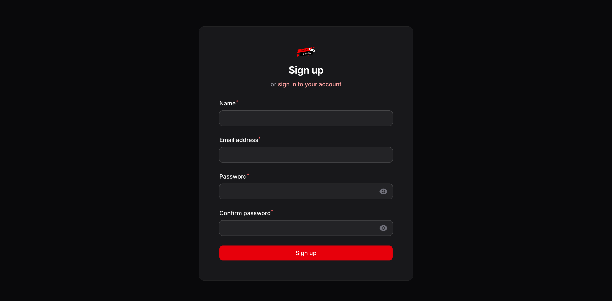
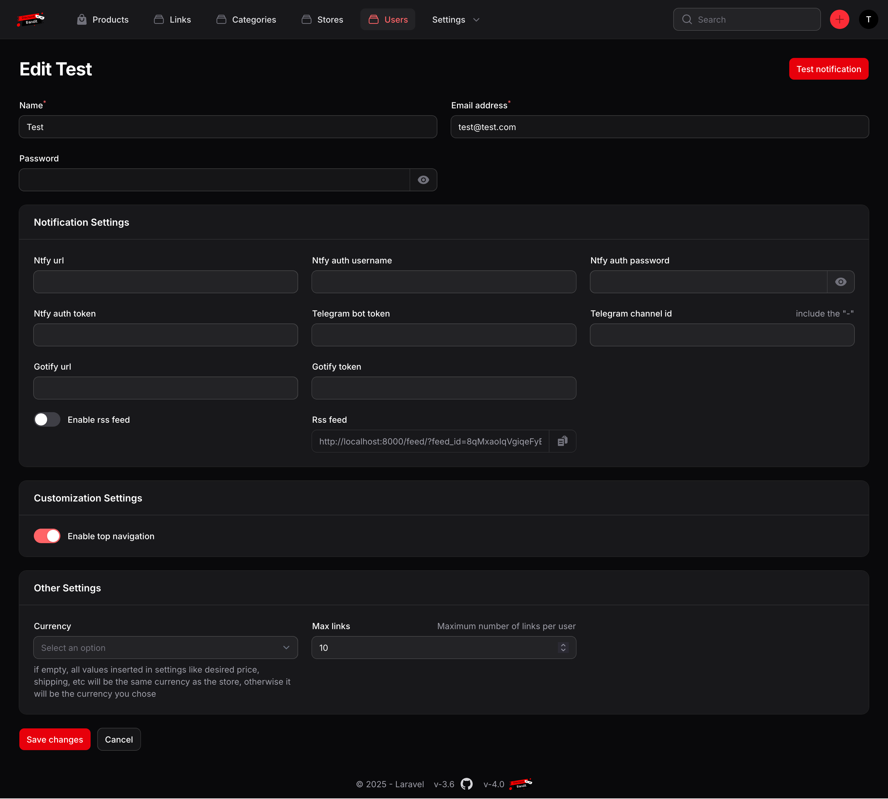
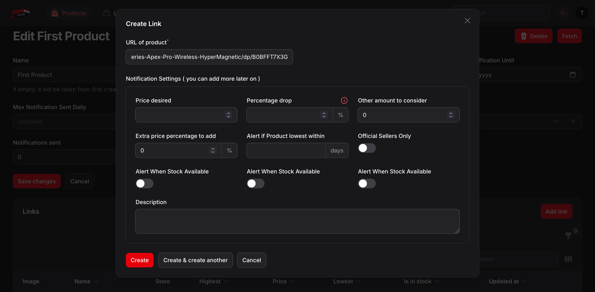
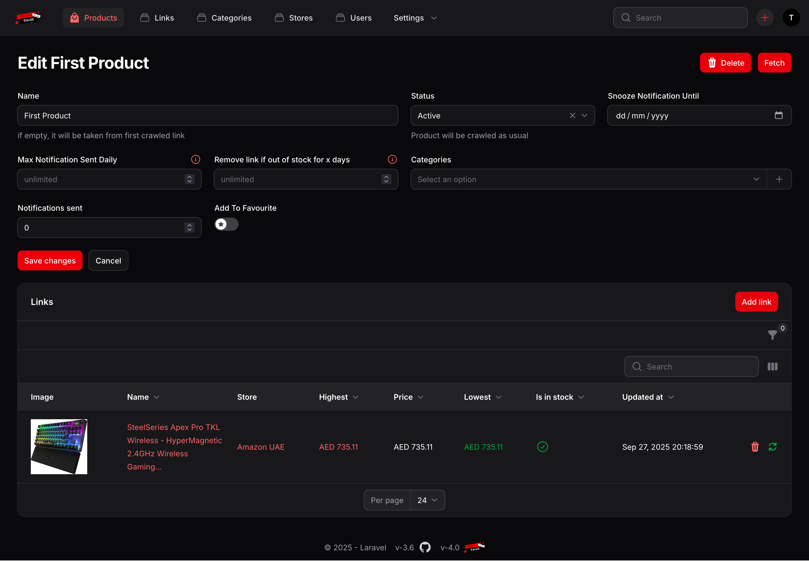
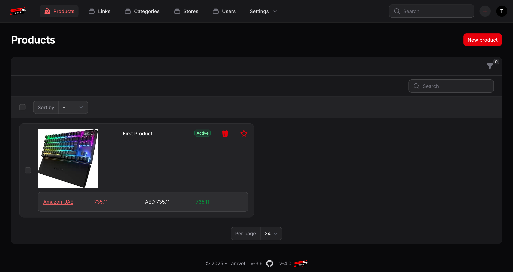
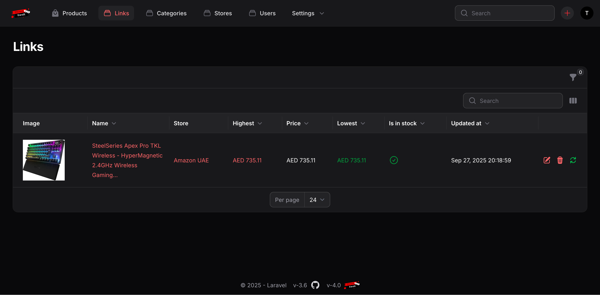
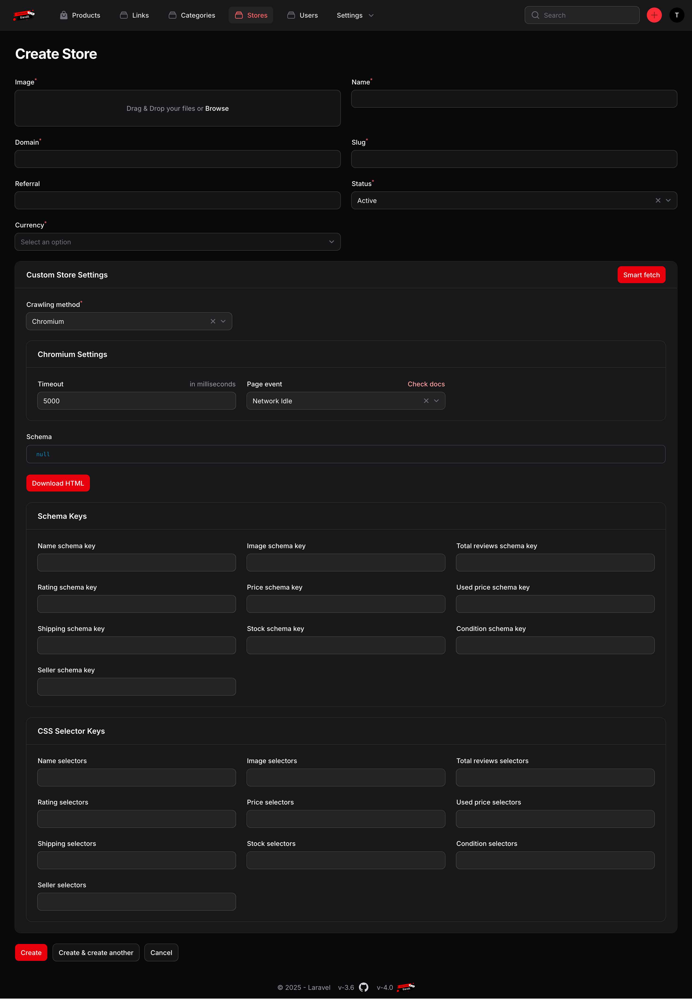
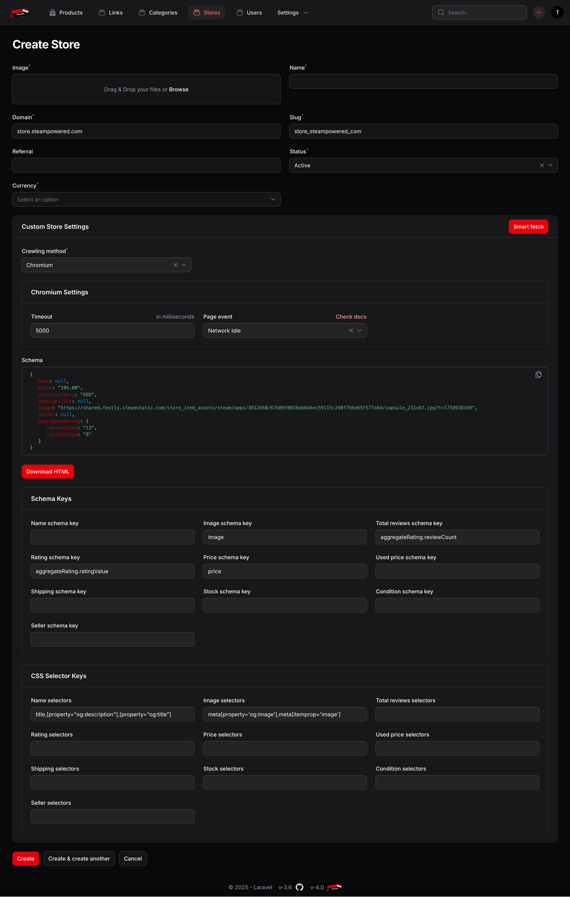

# Getting started
Discount Bandit Is an open source tool where you can track your favourite products across multiple stores, and get notified when a product matches your criteria.

## Is Discount Bandit Free
Yes, Discount Bandit is an open source project, completely free.

## Data Collection Policy
Discount Bandit Doesn't collect any data, it doesn't use any analytics service, nor sending data from your server to any website other than the stores added in the system to crawl the products.

## How Many Product Can I Add
You can add as many products as you want, but by default, Discount Bandit will crawl 60 products per store every 5 minutes. We do NOT recommend changing this settings as your IP will be treated as a  bot.

## Screenshots

|                          {#remove_header}                           |                                                                    |
|:-------------------------------------------------------------------:|:------------------------------------------------------------------:|
|                                 |                  | 
|                 |  |
|             |                |
|                     |        |
|   |   |

